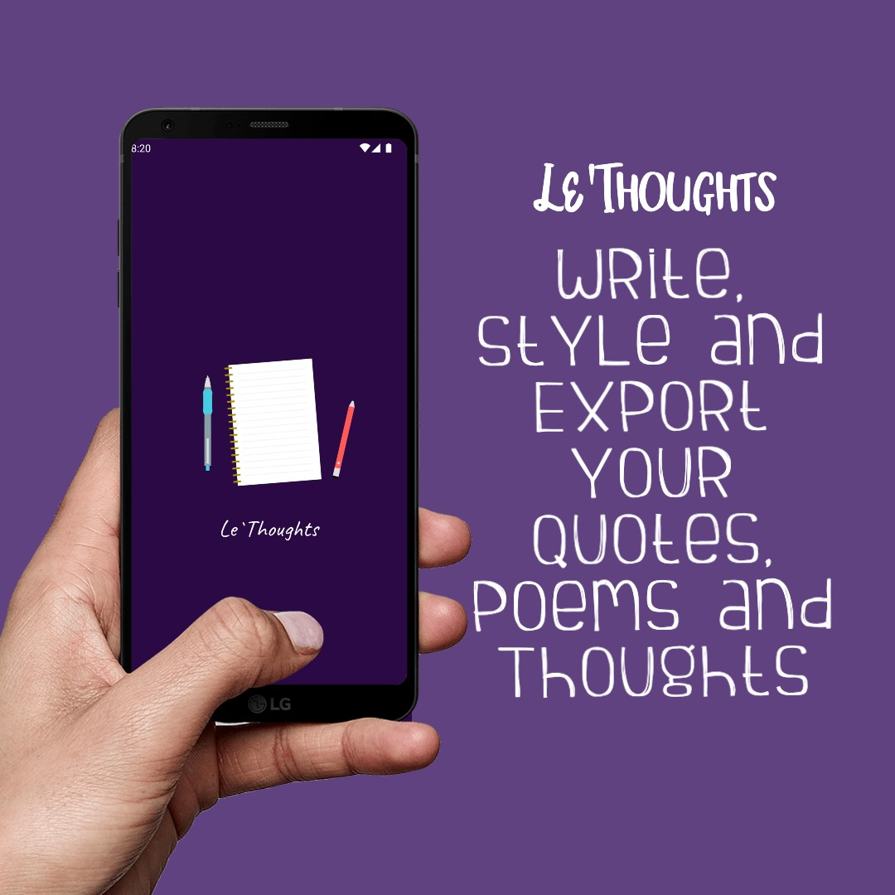
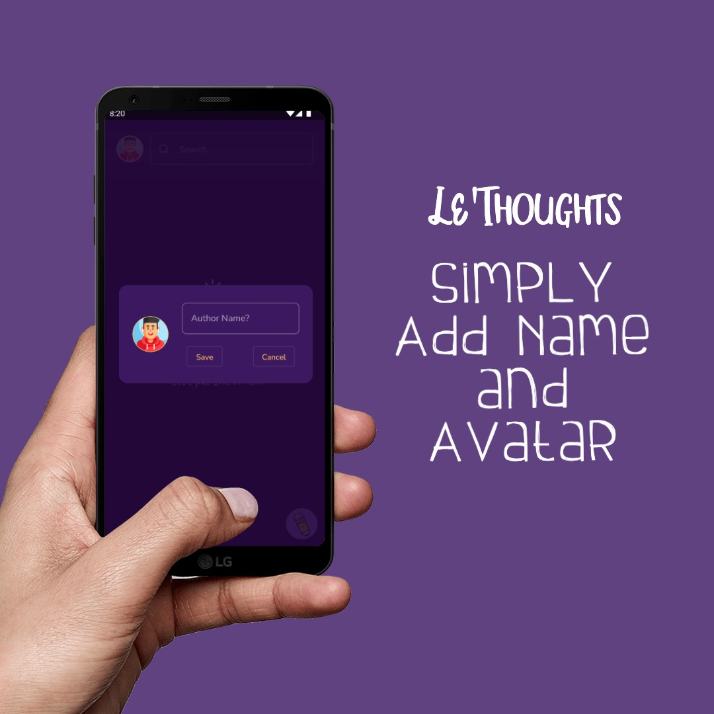
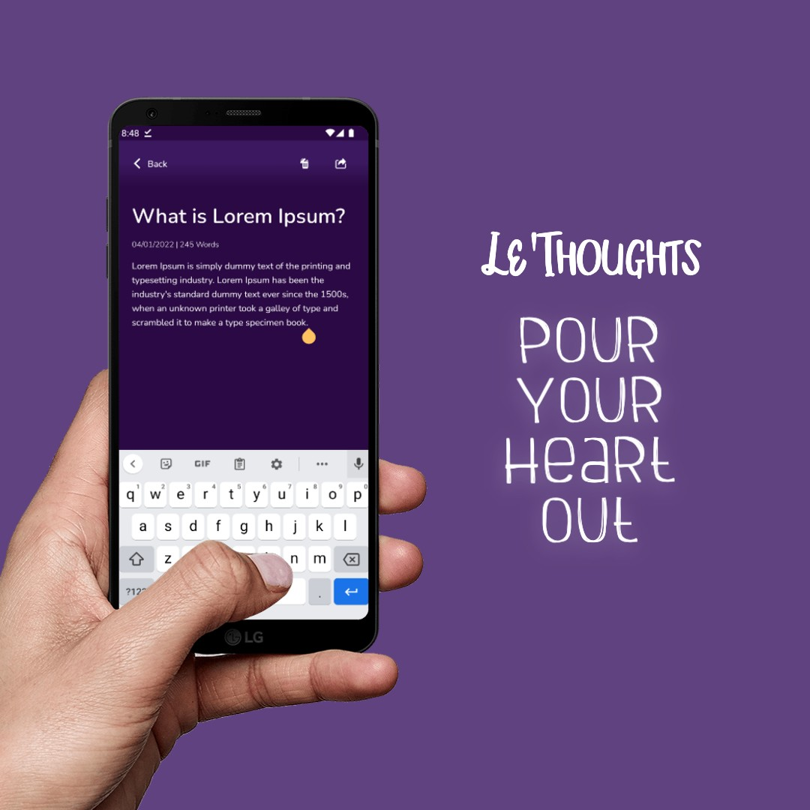
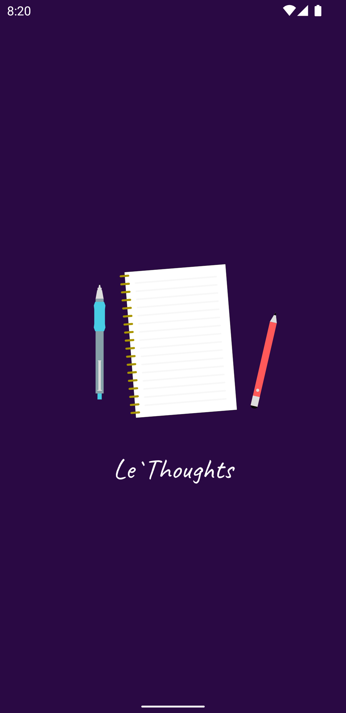
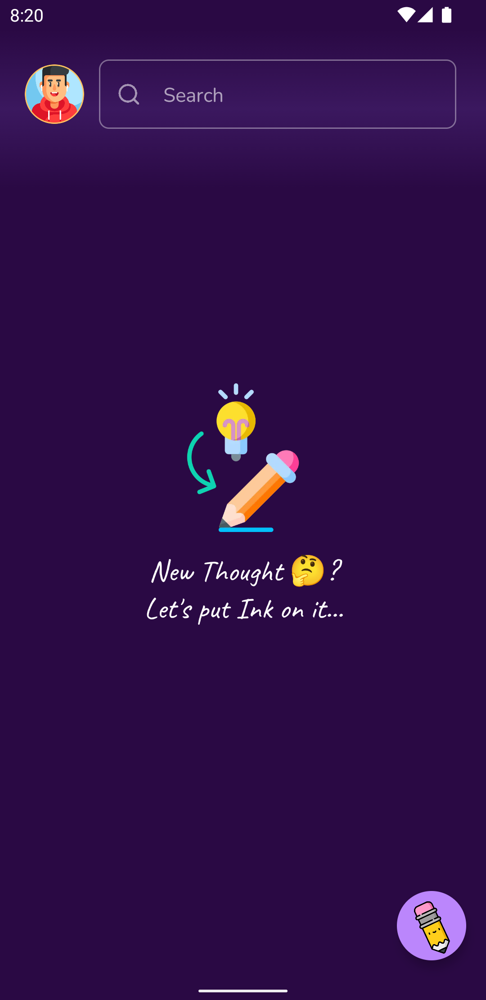
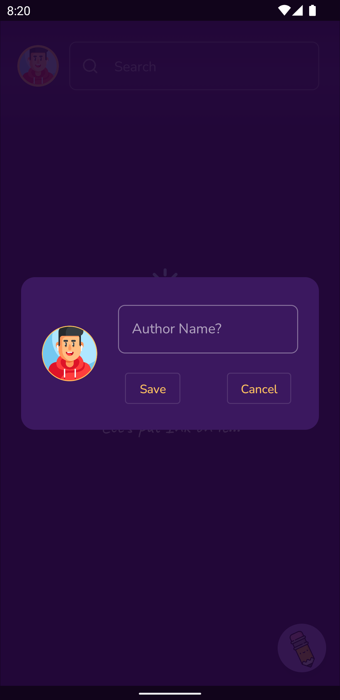
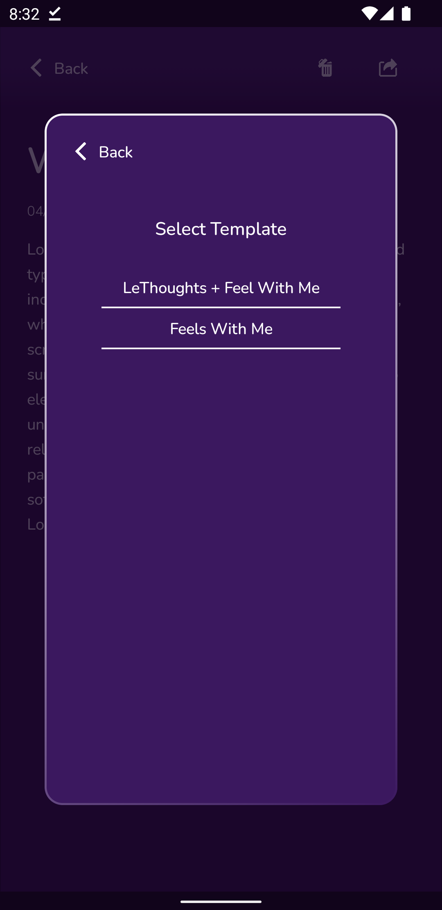
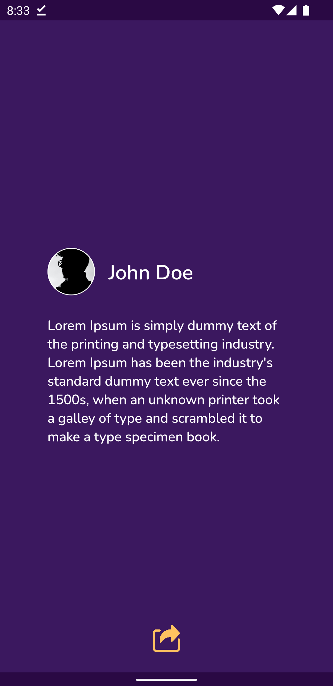
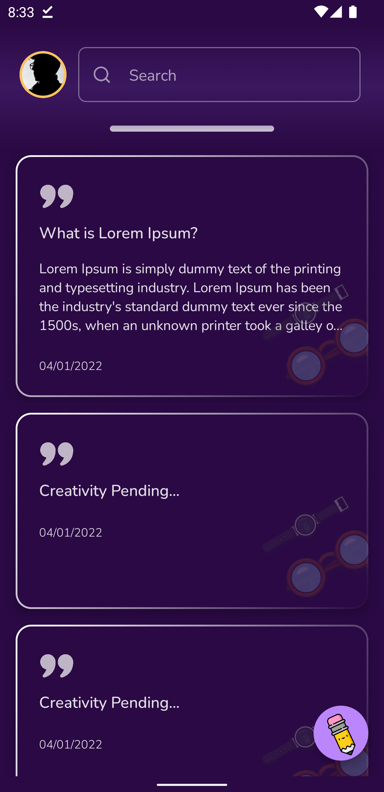
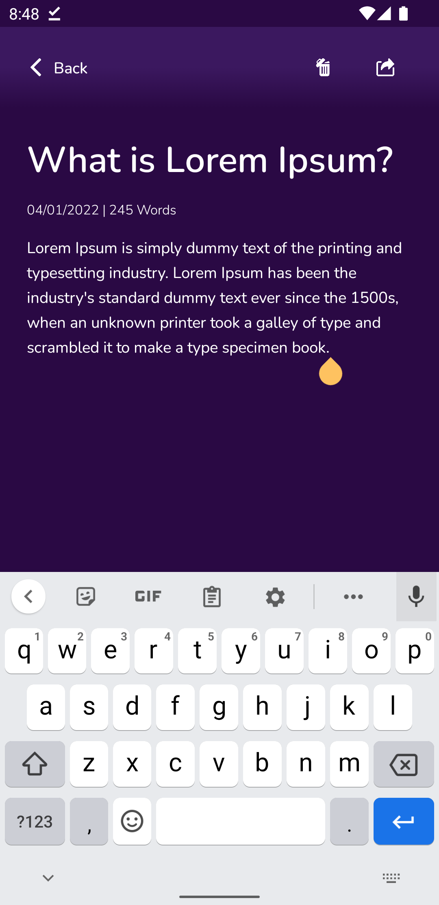

# Compose-Thoughts
Get it on playstore

<a href='https://play.google.com/store/apps/details?id=io.github.ch8n.thoughts'></a>


## A Jetpack Compose Poem writing application


## Inspiration

> My friend [TheDroidCoder](https://twitter.com/theDroidCoder) writes lots of Quotes, Its an application for ease writing and designing process.

## Playstore Assets

<table>
  <tr>
    <td>
        
    </td>
    <td>
        
    </td>
  </tr>
  <tr>
    <td>
        
    </td>
    <td>
        
    </td>
  </tr>
</table>

## Preview V1

<table>
  <tr>
    <td>
        
    </td>
    <td>
        
    </td>
    <td>
        
    </td>
  </tr>

  <tr>
      <td>
          
      </td>
      <td>
          
      </td>
      <td>
          
      </td>
    </tr>
    <tr>
        <td>
            
        </td>
    </tr>
</table>

## Features

### V1

- [x] Write poem
- [x] Pick solid color - Black
- [x] Pick Text color - White
- [x] Pick avatar image
- [x] Shared Image
- [x] Save as draft
- [x] Avatar Preview
- [x] Image from Gallery
- [x] Crash Analytics -> Firebase
- [x] App Performance -> Firebase
- [x] Only dev logging -> Timber
- [x] Application icon

### V2

## Background
- [ ] Create Template 
- [ ] Save Template
- [ ] Notifications -> Firebase
- [ ] Export/Import poems as csv
- [ ] Room db migration
- [ ] App update -> Firebase
- [ ] Export/Import poems as csv
- [ ] Image blurring
- [ ] Multiple Color Select
- [ ] Color Gradient
- [ ] share image from resolution

## Fonts

- [ ] Multiple Font Preview
- [ ] Styles - Underline, Bold, Italic, Normal
- [ ] Alignment - left, right, center
- [ ] Text Colors

## Sound

- [ ] Voice to text
- [ ] Narrate Mode -> record quote 1 min max
- [ ] background music picker 1 min max
- [ ] sound cropper | Selector and Preview
- [ ] Export as MP4

## Overlay

- [ ] Add images as overlay
- [ ] image blend mode
- [ ] alpha control

### V3

Social Platform

- [ ] Share Feeds
- [ ] Like | Dislike
- [ ] Follow | share

## Security

- [ ] removed support for links

## Blog and Portfolio @ [Chetangupta.net](https://chetangupta.net/about)

## Built With 🛠

- [Kotlin](https://kotlinlang.org/) official programming language for Android development.
- [Jetpack Compose](https://developer.android.com/jetpack/compose) Android’s modern toolkit for building native UI.

## Build-tool 🧰

You need to have [Android Studio](https://developer.android.com/studio) to build this project.

## :eyes: Social

[LinkedIn](https://bit.ly/ch8n-linkdIn) | [Medium](https://bit.ly/ch8n-medium-blog) | [Twitter](https://bit.ly/ch8n-twitter) | [StackOverflow](https://bit.ly/ch8n-stackOflow) | [CodeWars](https://bit.ly/ch8n-codewar) | [Portfolio](https://bit.ly/ch8n-home) | [Github](https://bit.ly/ch8n-git) | [Instagram](https://bit.ly/ch8n-insta) | [Youtube](https://bit.ly/ch8n-youtube)

## :cop: License

```
# MIT License

Copyright (c) 2021 Chetan Gupta

Permission is hereby granted, free of charge, to any person obtaining a copy
of this software and associated documentation files (the "Software"), to deal
in the Software without restriction, including without limitation the rights
to use, copy, modify, merge, publish, distribute, sublicense, and/or sell
copies of the Software, and to permit persons to whom the Software is
furnished to do so, subject to the following conditions:

The above copyright notice and this permission notice shall be included in all
copies or substantial portions of the Software.

THE SOFTWARE IS PROVIDED "AS IS", WITHOUT WARRANTY OF ANY KIND, EXPRESS OR
IMPLIED, INCLUDING BUT NOT LIMITED TO THE WARRANTIES OF MERCHANTABILITY,
FITNESS FOR A PARTICULAR PURPOSE AND NONINFRINGEMENT. IN NO EVENT SHALL THE
AUTHORS OR COPYRIGHT HOLDERS BE LIABLE FOR ANY CLAIM, DAMAGES OR OTHER
LIABILITY, WHETHER IN AN ACTION OF CONTRACT, TORT OR OTHERWISE, ARISING FROM,
OUT OF OR IN CONNECTION WITH THE SOFTWARE OR THE USE OR OTHER DEALINGS IN THE
SOFTWARE.
```
